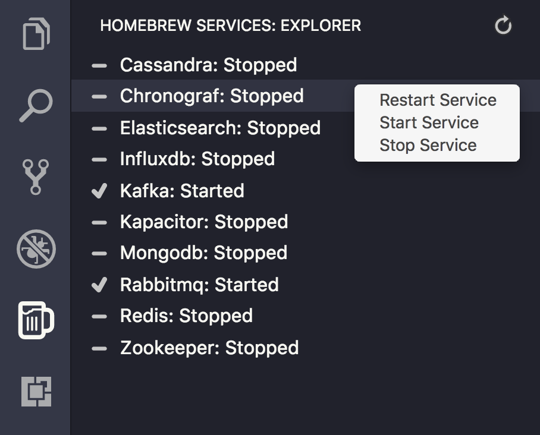

# Homebrew Services for Visual Studio Code

![Build Status][badgeBuild] ![Coverage Status][badgeCov]

The Brew Services extension makes it easy to start and stop services intalled via [Homebrew][brew] (required) on OSX from Visual Studio Code.

Available on the [VS Marketplace][marketplace].

### Attributions

[Typicons][typicons] by Stephen Hutchings - Fantastic open source icons.

<!-- Links -->
[badgeBuild]: https://travis-ci.org/beauallison/homebrew-services-vscode.svg?branch=master
[badgeCov]: https://coveralls.io/repos/github/beauallison/homebrew-services-vscode/badge.svg?branch=master
[brew]:https://brew.sh/
[marketplace]:https://marketplace.visualstudio.com/items?itemName=beauallison.brew-services
[typicons]:https://github.com/stephenhutchings/typicons.font