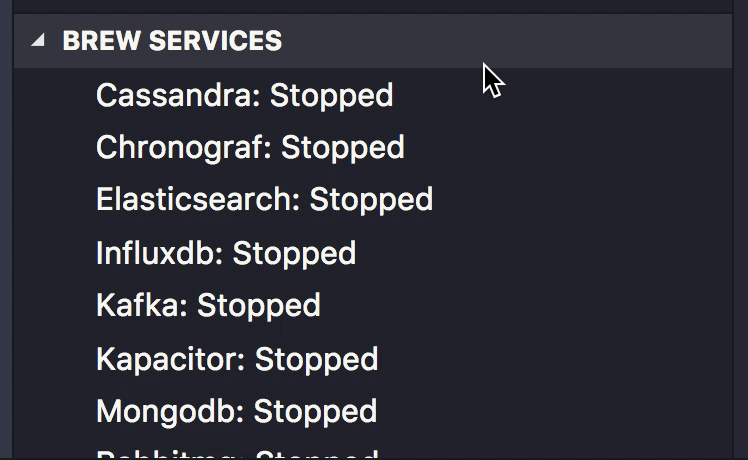

# Homebrew Services Support for Visual Studio Code

The Brew Services extension makes it easy to start and stop services intalled via Homebrew on OSX from Visual Studio Code.

## Requirements

- [Brew](https://brew.sh/)
- [Visual Studio Code](https://code.visualstudio.com)

## View

